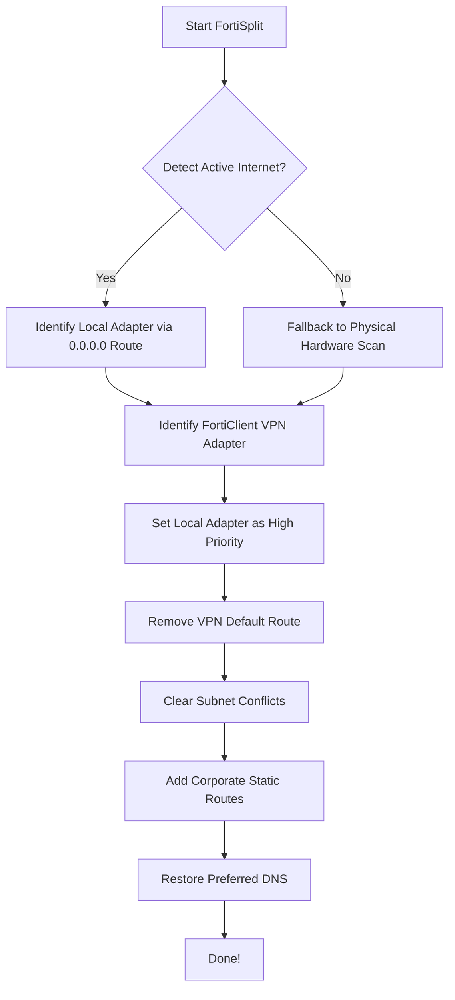

# FortiSplit: Intelligent VPN Split Tunneling & DNS Fixer

[](https://opensource.org/licenses/MIT)
[](https://www.microsoft.com/windows)
[](https://microsoft.com/powershell)
[](https://github.com/sakirsek/FortiSplit)

FortiClient VPN is notoriously aggressive — it hijacks **all** your internet traffic (`0.0.0.0/0`) and overrides your DNS settings. The result? Slow browsing, no local network access (printers, NAS, local IPs), and every single request routed through your company's tunnel.

**FortiSplit** is a lightweight, zero-dependency PowerShell script that automates **split tunneling**. It restores your local internet speed and local network access while keeping corporate traffic strictly inside the VPN tunnel.

---

## 📑 Table of Contents
- [🚀 Key Features](#-key-features)
- [📦 Installation](#-installation)
  - [Quick Install](#quick-install-powershell)
  - [Manual Installation](#manual-installation)
- [⚙️ How It Works](#️-how-it-works)
- [📝 Configuration](#-configuration)
- [🔧 Troubleshooting](#-troubleshooting)
- [📋 Requirements](#-requirements)
- [🤝 Contributing](#-contributing)

---

## 🚀 Key Features

| Feature | Description |
|---|---|
| **Language Independent** | Uses route-based detection instead of hardcoded names like "Wi-Fi" |
| **Automated Routing** | Routes only corporate IPs through VPN; everything else goes to your local ISP |
| **DNS Leak Fix** | Restores your preferred DNS (Google / Cloudflare) while VPN is active |
| **Smart Detection** | Automatically finds active physical adapters and ignores virtual interfaces |
| **Subnet Cleanup** | Removes VPN-injected routes that conflict with your home/office LAN |
| **Global Command** | Can be installed as a global `fortisplit` command for instant access |

---

## 📦 Installation

### Quick Install (PowerShell)

Run this command in **PowerShell** to install FortiSplit globally:

```powershell
irm https://raw.githubusercontent.com/sakirsek/FortiSplit/main/install.ps1 | iex
```

**After installation, you can simply type this in any terminal (CMD or PowerShell):**

```bash
fortisplit
```

> [!TIP]
> If the command is not recognized immediately, please restart your terminal window to refresh the environment variables.

### Manual Installation

1. **Download** [FortiSplit.ps1](https://raw.githubusercontent.com/sakirsek/FortiSplit/main/FortiSplit.ps1).
2. **Connect** to your VPN via FortiClient.
3. **Open PowerShell** as Administrator.
4. **Run** the script:
   ```powershell
   Set-ExecutionPolicy Bypass -Scope Process -Force; .\FortiSplit.ps1
   ```

---

## ⚙️ How It Works



> [!IMPORTANT]
> **Re-run after every connection:** FortiClient resets all routing and DNS settings every time you connect or reconnect to the VPN. You must run `fortisplit` again after each reconnection to restore split tunneling.

---

## 📝 Configuration

Open `FortiSplit.ps1` and edit the **User Configuration** section:

### Corporate Networks
Define which IP ranges should go through the VPN tunnel:
```powershell
$TARGET_NETWORKS = @(
    @{ IP = "10.0.0.0";  Mask = "255.0.0.0" }          # Most common corporate range
    # @{ IP = "172.16.0.0"; Mask = "255.240.0.0" }      # Uncomment if needed
)
```

### DNS Servers
Choose your preferred DNS providers (default is Google + Cloudflare):
```powershell
$PREFERRED_DNS = @("8.8.8.8", "1.1.1.1")
```

---

## 🔧 Troubleshooting

| Problem | Solution |
|---|---|
| "No active FortiClient VPN adapter found" | Connect to VPN first, wait ~10 seconds, then run the script |
| "No active local network adapter found" | Ensure you are connected to the internet. The script uses your active internet route to find the adapter. |
| Permission Denied | The script requires Administrator privileges to modify routing tables. It will request them automatically. |
| Corporate app not working | Ensure the app's IP range is listed in `$TARGET_NETWORKS`. |

---

## 📋 Requirements

- **OS:** Windows 10 / 11
- **PowerShell:** 5.1 or later (pre-installed on Windows)
- **Privileges:** Administrator
- **VPN Client:** FortiClient (any version)

## ⚠️ Security Disclaimer

This script modifies local routing tables and DNS settings. These changes are temporary and reset when you disconnect VPN or reboot. However, **ensure this complies with your company's IT security policy** before use.

## 🤝 Contributing

Contributions are welcome! If you have ideas for improvements or find a bug, feel free to open an issue or a pull request.

1. Fork the repo
2. Create your branch (`git checkout -b feature/AmazingFeature`)
3. Commit your changes (`git commit -m 'Add AmazingFeature'`)
4. Push to the branch (`git push origin feature/AmazingFeature`)
5. Open a Pull Request

## 📄 License

This project is licensed under the MIT License — see the [LICENSE](LICENSE) file for details.

---
*If this project helped you, please consider giving it a ⭐ on GitHub!*
